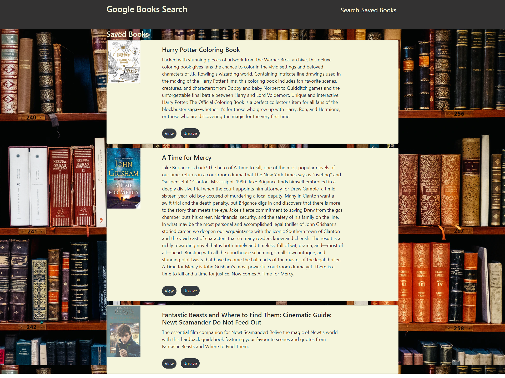

# React Google Books Search

## Table of Contents
  - [Technologies](#technologies-used)
  - [Description](#description)
  - [Deployed Site](#deployed-site)
  - [Installation](#installation)
  - [Usage](#usage)
  - [License](#license)

## Technologies Used

  - MongoDB
  - Express
  - React
  - NodeJs
  - React-Router
  - Google Books API
  - Axios
  - Mongoose
  - Bootstrap

## Description
Google Books Search app that displays books based on user inputs, the user can then choose to view the Google Books page for that book or save the book for later.
Saved books are then displayed on the Saved Books page where you can unsave or view the book's Google Books page.

## Deployed Site

<a href = "https://react-app-google-books-13.herokuapp.com">Click Here to view the Deployed App With Heroku</a>

## Installation 
Clone the repo, open in terminal, run npm install

## Usage
After the installation steps are done, run npm start in the terminal

## License
MIT License
Copyright (c) [2020] [Brandon Waller]

